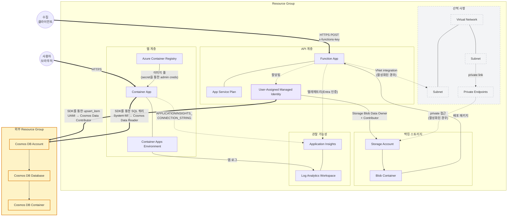

# Azure MCP로 구현하는 엔드투엔드 Agentic DevOps — 배포, 강화, 파괴, 조사

**핸즈온 랩(75분) | Level: 300 | LAB501**

AI는 5분 만에 여러분의 앱을 Azure에 배포할 수 있습니다. 그런데 AI가 만든 결과물을 그대로 믿어도 될까요? 이 랩에서는 GitHub Copilot CLI와 Azure skill을 사용해 실제로 동작하는 Container App을 배포합니다. Azure Cosmos DB를 백엔드로 LEGO set 카탈로그를 탐색하는 Python Flask 애플리케이션과, 새 LEGO set을 Cosmos DB에 upsert하는 Function App을 함께 배포합니다. 그런 다음 아키텍트의 관점으로 AI의 결정을 평가합니다. 생성된 Bicep 파일을 검토하고, 프로덕션 준비에 무엇이 빠졌는지 찾아내며, AI에게 배포 강화를 지시하고, 앱을 일부러 망가뜨린 뒤 전체 포렌식 조사를 수행합니다. 이 모든 작업을 Azure 포털을 열지 않고 진행합니다.

> 💡 **AI 응답은 이 가이드의 설명과 다를 수 있습니다.** 정확한 출력이 아니라 어떤 skill이 활성화되는지, 그리고 추론 패턴에 집중하세요. 프롬프트는 검증을 거쳤지만 AI는 비결정적이므로 결과가 조금씩 다르게 보일 수 있습니다.

### 목표 아키텍처

## 배우게 될 내용

- Azure **skill**이 어떻게 서로 연결되는지 — 하나의 프롬프트가 `prepare` → `validate` → `deploy`를 자동으로 트리거합니다
- AI가 생성한 인프라가 어디까지 80%를 채워 주는지, 그리고 여러분이 직접 메워야 할 프로덕션 격차가 무엇인지
- AI가 생성한 Bicep, Dockerfile, 아키텍처 다이어그램을 비판적으로 검토하는 방법
- `azure-diagnostics`가 문제를 추론하는 방식 — triage 패턴, 로그 상관 분석, KQL 생성
- AI의 결정을 언제 신뢰하고 언제 재정의해야 하는지
- managed identity를 사용해 컨테이너화된 앱을 미리 프로비저닝된 Azure Cosmos DB에 연결하는 방법

## 사용하는 Skill — 4개 시나리오에 걸친 6개 Skill

| # | Skill | 하는 일 | 시나리오 |
|---|---|---|---|
| 1 | `azure-prepare` | 두 가지 시작점을 한 번에 처리합니다. 기존 Flask 소스 코드 주변에 IaC + 구성을 감싸고(Container Apps), 동시에 Python Azure Functions 템플릿을 가져와 프롬프트에 맞게 다듬습니다(Flex Consumption) | 1A: 배포 |
| 2 | `azure-validate` | 사전 점검: Bicep 컴파일, Docker 상태(Container Apps), Python 런타임 + Flex Consumption 가용성(Functions), 구독 접근 권한 | 1A: 배포 |
| 3 | `azure-deploy` | `azd up`을 실행해 인프라를 프로비저닝하고 두 서비스(Flask Container App과 Python Function App)를 빌드 및 배포합니다 | 1A: 배포 |
| 4 | `azure-rbac` | Azure 문서에서 least-privilege 역할을 찾아 할당 명령을 생성합니다 | 1B: 강화 |
| 5 | `azure-resource-visualizer` | Resource Graph를 쿼리하고 관계를 매핑해 Mermaid 다이어그램을 생성합니다 | 2: 관찰 |
| 6 | `azure-diagnostics` | 시스템 로그를 가져오고 진단 추론 과정을 따라 근본 원인에 도달합니다. KQL 쿼리를 작성하고 경고 규칙을 만듭니다 | 3: 파괴, 4: 조사 |

> 📖 **용어집:** **ACR** = Azure Container Registry(private Docker 이미지 저장소). **AZD** = Azure Developer CLI(`azd`). **Bicep** = Azure의 IaC 언어. **Cosmos DB** = Azure의 전 세계 분산 NoSQL 데이터베이스. **KQL** = Kusto Query Language(로그 쿼리용). **MCP** = Model Context Protocol.

## 랩 섹션

| # | 섹션 | 파일 | 소요 시간 |
|---|---------|------|----------|
| 1 | [사전 준비물](01-prerequisites.md) | `01-prerequisites.md` | 세션 전 |
| 2 | [로그인 및 실행](02-login-and-launch.md) | `02-login-and-launch.md` | ~5분 |
| 3 | [스타터 앱 설정](03-getting-started.md) | `03-getting-started.md` | ~5분 |
| 4 | [시나리오 1 — 배포하고 강화하기](04-scenario-1-ship-and-harden.md) | `04-scenario-1-ship-and-harden.md` | ~25분 |
| 5 | [시나리오 2 — 관찰하고 평가하기](05-scenario-2-see-and-evaluate.md) | `05-scenario-2-see-and-evaluate.md` | ~10분 |
| 6 | [시나리오 3 — 파괴하고 진단하기](06-scenario-3-break-and-triage.md) | `06-scenario-3-break-and-triage.md` | ~10분 |
| 7 | [시나리오 4 — 조사하고 운영화하기](07-scenario-4-investigate-and-operationalize.md) | `07-scenario-4-investigate-and-operationalize.md` | ~15분 |
| 8 | [문제 해결](08-troubleshooting.md) | `08-troubleshooting.md` | 참고 |
| 9 | [다음 단계](09-whats-next.md) | `09-whats-next.md` | 참고 |
