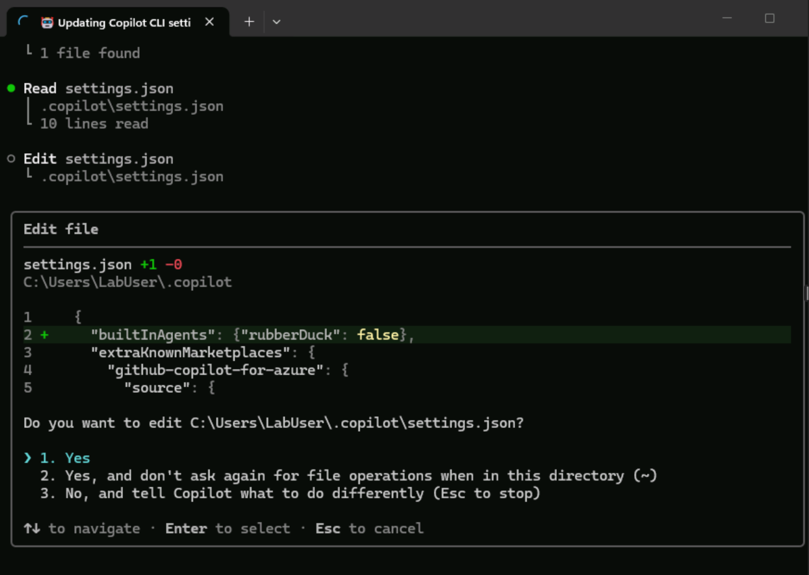

# 시작하기 전에 — 로그인 및 실행

## 1. Azure에 로그인하기

터미널을 엽니다 — 단축키(Ctrl + Shift + 4)로 PowerShell을 여세요 — 그리고 다음 단계를 완료하세요.

```bash
az login
```

로그인 팝업이 나타나면 **Work or school account**를 선택하고 **Continue**를 누르세요. Skillable VM의 **Resources** 탭에서 키보드 아이콘을 클릭해 사용자 이름을 입력하고 **Next**를 선택하세요. 그런 다음 같은 탭에서 키보드 아이콘을 클릭해 TAP를 입력하면 로그인이 완료됩니다. **Sign in to all apps and websites on this device?** 대화 상자에서 **Yes**를 클릭하세요.

터미널이 구독 선택을 요청하면 변경 없이 **Enter**를 누르세요.

> ⚠️ **"Microsoft account"(개인/소비자 계정)는 절대 선택하지 마세요.** 로그인 페이지에 여러 옵션이 표시될 수 있으니 항상 **Work or school account**를 선택하세요. 잘못된 옵션을 선택하면 access-denied 오류가 발생합니다.

## 2. Azure Developer CLI에 로그인하기

```bash
azd auth login
```

이전 단계의 Azure 계정을 선택하고 인증을 완료하세요.

## 3. GitHub에 로그인하기

브라우저에서 이 링크를 엽니다: <a href="https://github.com/enterprises/skillable-events/sso" target="_blank" rel="noopener noreferrer">https://github.com/enterprises/skillable-events/sso</a>. Skillable Events에 single sign-on을 묻는 메시지가 나오면 **Continue**를 선택하세요. 방금 인증한 Azure 계정을 선택하고, 안내에 따라 인증을 완료하세요.

## 4. GitHub Copilot CLI에 로그인하기

다음 명령을 입력해 GitHub Copilot CLI를 시작하세요.

```bash
copilot
```

이 명령은 대화형 Copilot CLI 세션을 엽니다. 이 랩의 모든 "Copilot에 입력" 프롬프트는 여기에 입력합니다. **이 세션을 랩이 끝날 때까지 열어 두세요** — 여기서 AI skill과 상호작용합니다.

> 💡 **터미널 vs. Copilot:** 이 랩 전반에서 명령을 두 곳에서 실행합니다. **Copilot CLI**는 AI 기반 프롬프트(예: "Deploy my app to Azure")를 위한 곳입니다. **터미널 명령**(Copilot에서 `!` 접두사가 붙은 명령)은 `curl`, `az`, `git` 같은 셸 작업을 위한 것입니다. 헷갈릴 때는 명령 앞에 `!`를 붙여 Copilot 안에서 어떤 터미널 명령이든 실행할 수 있습니다.

```bash
/login
```

어떤 계정으로 로그인할지 묻는 메시지가 나오면 GitHub.com을 선택하세요. Copilot이 아무 키나 눌러 브라우저를 열어 로그인을 완료하라고 안내합니다. Copilot의 지침을 따라 로그인한 계정으로 권한 부여를 완료하세요.

## 5. Rubberduck Agent 비활성화하기

랩 세션에 필요하지 않으므로, 다음 프롬프트를 Copilot에 사용해 Copilot CLI에서 rubber duck agent를 비활성화하세요.

Copilot에 입력
```
 Update the settings.json for Copilot CLI to disable rubber duck with this, "builtInAgents": {"rubberDuck": false},
```    




## 6. Azure Skills 플러그인 설치하기

1. Microsoft 마켓플레이스를 추가합니다.
   ```
   /plugin marketplace add microsoft/azure-skills
   ```

2. Azure 플러그인을 설치합니다.
   ```
   /plugin install azure@azure-skills
   ```

3. Azure MCP를 다시 로드합니다.
   ```
   /mcp reload
   ```
4. **터미널을 닫으세요.** 그래야 다음에 copilot을 열 때 변경된 copilot 설정이 적용됩니다.

> 💡 **MCP 도구 vs. Azure skill:** Azure MCP 서버는 리소스 목록 조회, 로그 쿼리, 배포 관리 같은 저수준 작업인 **MCP 도구**를 제공합니다. Azure **skill**은 이러한 도구를 도메인 지식과 함께 연결하는 더 높은 수준의 프롬프트 지침입니다(예: `azure-diagnostics`는 triage 추론 과정을 따르는 방법을 압니다). 이 랩은 둘 다 사용합니다. skill이 워크플로를 이끌고, MCP 도구가 Azure 작업을 실행합니다.

> 💡 **팁:** 나중에 플러그인을 업데이트하려면 다음을 실행하세요.
> ```
> /plugin update azure@azure-skills
> ```

✅ **체크포인트:** GitHub와 Azure에 로그인했고, Copilot CLI가 실행 중이며, Azure skill과 Azure MCP Server가 설치되었습니다.

---

**다음:** [스타터 앱 설정 →](03-getting-started.md)
